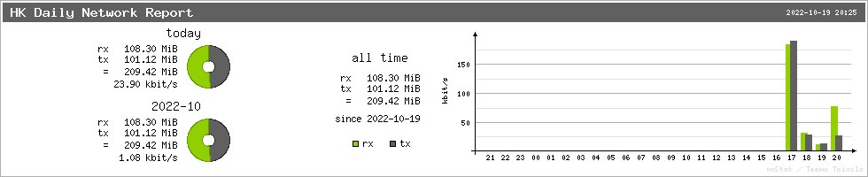

# Network Reporter
通过 Telegram Bot 查看服务器每天的流量使用情况。

## Install
1. 安装 vnstat 和 vnstati
```bash
apt install -y vnstat vnstati
```
2. 编写配置文件 `/etc/network-reporter/config.yaml`
```yaml
BOT_TOKEN: BOT_TOKEN 
CHAT_ID: CHAT_ID 
DEVICE: ens3
HEADER: HK Daily Network Report
```
3. 自行编译或下载 Release
```bash
#clone
git clone https://github.com/Zwlin98/network-reporter
cd network-reporter
# 可以修改源代码中 vnstati 使用的参数,来修改报告图的样式
#build
go build
mv network-reporter /usr/local/bin/
```
4. crontab 定时任务
```crontab
# 每天早上9点发送报告
0 9 0 0 0 /usr/local/bin/network-reporter
```

## Preview

